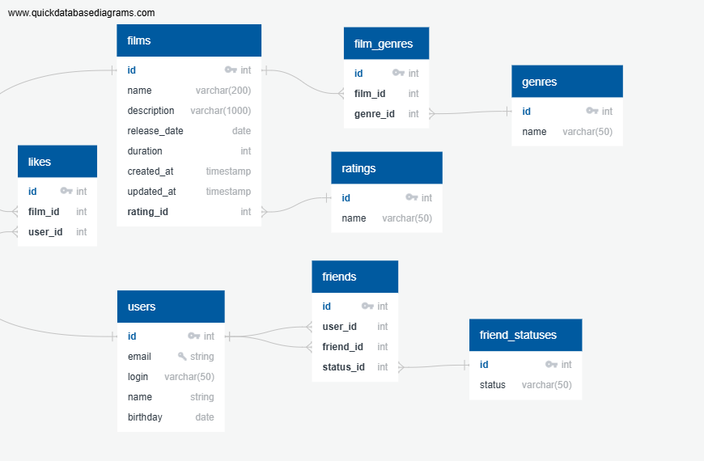

# java-filmorate
Template repository for Filmorate project.

## Схема данных



## Примеры запросов

получить всех пользователей
```SQL
    SELECT * FROM users
```

получить пользователя по id
```SQL
    SELECT * FROM users WHERE id = :userId
```

создать пользователя
```SQL
INSERT INTO users(email, login, name, birthday) VALUES(:email, :login, :name, :birthday)
```
